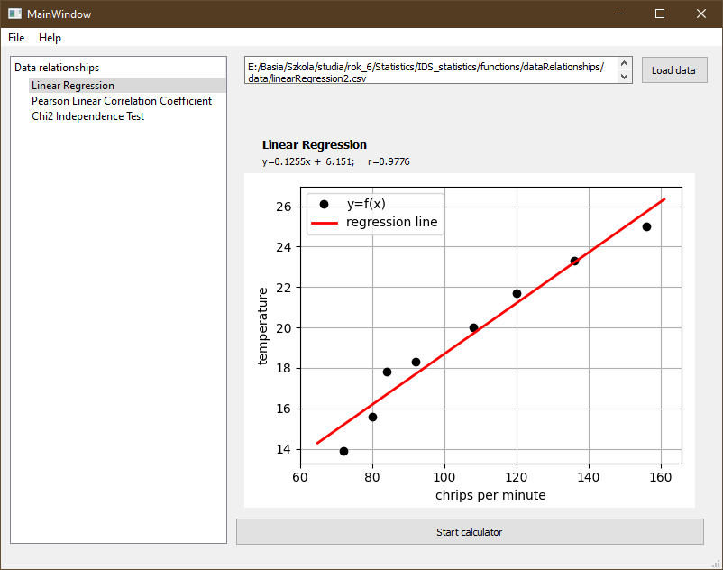

# Data relationships

This package includes three algorithms:

- Chi2 independence test based
- Pearson linear correlation coefficient
- Linear regression

### Create virtualenv
Firstly, You have to install required packages included in ``requirements.txt`` file.

On Unix-based systems run:
```bash
pip3 install -r requirements.txt
```

and on Windows:
```bash
pip install -r requirements.txt
```

### Launch

To launch calculator run ``MainWindow.py``:

On Unix-based systems run:
```bash
cd functions/dataRelationships
python3 MainWindow.py
```

and on Windows:
```bash
cd functions\dataRelationships
python MainWindow.py
```

### Use


Firstly, choose algorithm You want to use from the tree panel on the left.
Then load data. Example data are in ``functions/dataRelationships/data`` directory.
If exists, fill the parameters of the chosen algorithm and press ``Start Calculator button``.
Results will show on the screen.


## Screenshots
Linear regression window:




Chi2 independence test:


Pearson Correlation Coefficient:


